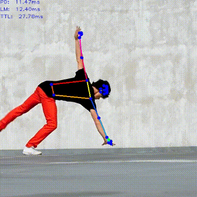

# blazepose_openvino
BlazePose model test program for Intel Distribution of OpenVINO toolkit

**WIP**

The BlazePose OpenVINO IR model can be obtained from [PINTO model zoo](https://github.com/PINTO0309/PINTO_model_zoo). 

### Example


## Configuration / Options
Current program doesn't support command line options.  
You can modify the source code to change input media/file and device to use for inferencing. Those configurations can be found on top of the `main.cpp` code.  

```c++
const std::string MODEL_POSE_DET = "../pose_detection/128x128/FP32/pose_detection";
const std::string MODEL_LM_DET   = "../pose_landmark_upper_body/256x256/FP32/pose_landmark_upper_body";

// INPUT_TYPE = { IMAGE_INPUT | VIDEO_INPUT | CAM_INPUT }
#define INPUT_TYPE    VIDEO_INPUT
const std::string INPUT_FILE = "../test.mp4";              /* Image or movie file */

// 'output.mp4' will be generated when this macro is defined and the input source is either one of VIDEO_INPUT or CAM_INPUT
#define VIDEO_OUTPUT
#define VIDEO_SIZE    (400)             /* output video size = (VIDEO_SIZE, VIDEO_SIZE) */

// Device to use for inferencing. Possible options = "CPU", "GPU", "MYRIAD", "HDDL", "HETERO:FPGA,CPU", ...
const std::string DEVICE_PD = "CPU";
const std::string DEVICE_LM = "CPU";

//#define RENDER_ROI
#define RENDER_TIME
#define RENDER_POINTS
```
